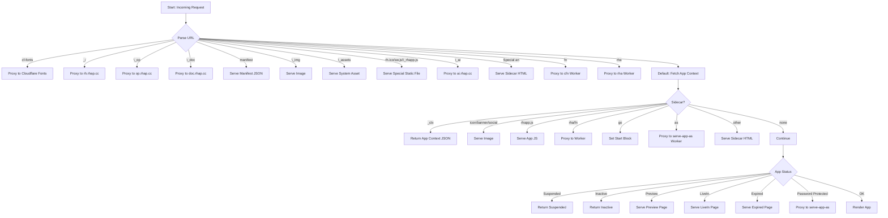

# serve_app.ts

This file implements the core application serving functionality for the Rhappsody Platform. It acts as a central router and handler for various types of requests in the platform's architecture.

## Overview

`serve_app.ts` is a Cloudflare Worker script that handles routing and serving of Rhappsody applications. It processes requests to `*.rhapp.app` domains and manages various aspects of the platform's functionality.

## Key Features

### 1. Request Routing
- Handles requests based on URL patterns and hostname components
- Parses application group (ag) and application name (an) from URLs
- Routes requests to appropriate services based on path segments

### 2. Special Endpoints

#### System Routes
- `/_/` - Runtime local path routing to rh.rhap.cc
- `/_op/` - Operations routing to op.rhap.cc
- `/_doc/` - Documentation routing to doc.rhap.cc
- `/_ai/` - AI service routing to ai.rhap.cc

#### Static Assets
- `/cf-fonts` - Cloudflare Font Optimization support
- `/_img` - Image handling for application assets
- `/_assets` - System-level asset handling
- Special files like `rh.ico`, `sw.js`, `_rhapp.js`

#### Application Management
- `/manifest` - Application manifest generation
- Special "AN" names handling for platform features (account, apps, auth, etc.)
- Cloud Function (CFN) calls at AG level

### 3. Application Serving
- Handles different application versions (latest, preview, oldversion)
- Manages application binary (rhbin) and context (ctx) files
- Supports various query parameters for version control

## Technical Details

### URL Structure
- Base format: `https://<ag>.rhapp.app/<an>/[sidecar]/[block]`
  - `ag`: Application Group
  - `an`: Application Name
  - `sidecar`: Optional component identifier
  - `block`: Optional block identifier

### Key Dependencies
- Imports rendering components from:
  - `renderApp.ts`
  - `renderLiveIn.ts`
  - `renderExpired.ts`
  - `renderManifest.ts`

### Configuration
- Uses predefined base URLs for various services:
  - Storage base: `https://sb.rhap.cc/storage/v1/object/public/apps`
  - Context base: `https://ctx.rhap.cc`

## Usage Examples

1. Serving an application:
   ```
   https://mygroup.rhapp.app/myapp
   ```

2. Accessing application assets:
   ```
   https://mygroup.rhapp.app/_img/logo/orig
   ```

3. Accessing system assets:
   ```
   https://mygroup.rhapp.app/_assets/system/asset.js
   ```

4. Cloud function calls:
   ```
   https://mygroup.rhapp.app/fn/myfunction
   ```

## Error Handling
- Handles application not found scenarios (404 responses)
- Manages invalid routes and requests
- Provides appropriate error responses for various failure scenarios

# `serve_app.ts` Overview

This document describes the logic and flow of the `serve_app.ts` file, which acts as a Cloudflare Worker (or similar edge function) to route and serve requests for Rhappsody Platform apps. It handles a variety of request types, static assets, app binaries, and special routes, providing a flexible backend for progressive web apps.

---

## High-Level Flow

- **Entry Point:** Handles all incoming HTTP requests via an exported `fetch` method.
- **URL Parsing:** Extracts key path segments and query parameters to determine routing.
- **Special Routes:** Handles static assets, images, manifests, and proxying to other services.
- **App Context:** Fetches and decodes app context to determine app state, version, and metadata.
- **Sidecar Handling:** Supports a wide range of sidecar routes for icons, banners, social images, JS, and more.
- **App Serving:** Renders the app or returns appropriate error/expired/inactive pages based on context.

---

## Main Routing Logic (Mermaid Diagram)



---

## Detailed Logic

### 1. **URL Parsing**
- Extracts subdomain (`ag`), app name (`an`), and path segments (`sidecar`, `block`, `other`).
- Checks for query parameters like `latest`, `preview`, `oldversion`.

### 2. **Special Route Handling**
- **Fonts, Docs, Ops:** Proxies requests to appropriate backend services.
- **Manifest:** Returns app manifest as JSON.
- **Images/Assets:** Serves images and system assets from storage.
- **Special Files:** Handles favicon, service worker, and app JS.
- **AI Proxy:** Proxies requests to AI backend.
- **Special App Names:** Serves static HTML for dashboard, signup, etc.
- **Function/Action Calls:** Proxies to Cloudflare Workers for serverless logic.

### 3. **App Context Fetching**
- Fetches the app context (`app.ctx`) from the context server.
- Decodes metadata from the `Content-Type` header (account, aid, version, status, etc).

### 4. **Sidecar Handling**
- Handles a wide range of sidecar routes:
  - `_ctx`: Returns app context as JSON.
  - `icon`, `banner`, `social`: Serves images.
  - `rhapp.js`: Serves the app's JavaScript bundle.
  - `rha`, `fn`: Proxies to serverless workers for actions/functions.
  - `go`: Sets the start block for app rendering.
  - `as`: Proxies to a worker for role-based or password-protected access.
  - Other: Serves static HTML pages for various app features.

### 5. **App Status Handling**
- **Suspended/Inactive:** Returns a message or error page.
- **Preview:** Serves a preview page if the plan allows.
- **LiveIn/Expired:** Checks timestamps to serve "live in" or "expired" pages.
- **Password Protected:** Proxies to a worker for authentication.
- **Default:** Renders the app using the `renderApp` function.

---

## Key Functions & Concepts

- **renderApp:** Renders the main app HTML using context and binary data.
- **renderLiveIn / renderExpired:** Renders special pages for not-yet-live or expired apps.
- **renderManifest:** Generates the app manifest JSON.
- **Cloudflare Workers:** Used for serverless function/action calls and secure proxying.
- **CORS Handling:** Sets appropriate headers for cross-origin requests.

---

## Example Request Flows

- **App HTML:** `https://<ag>.rhapp.app/<an>` → Fetches context, checks status, renders app.
- **App Icon:** `https://<ag>.rhapp.app/<an>/icon` → Serves icon image from storage.
- **Manifest:** `https://<ag>.rhapp.app/<an>/manifest` → Returns manifest JSON.
- **Action Call:** `https://<ag>.rhapp.app/<an>/rha/<action>` → Proxies to worker for action.
- **Preview:** `https://<ag>.rhapp.app/<an>?preview` → Serves preview page if allowed.

---

## Notes

- The file is highly extensible and supports a wide range of app and platform features.
- All static and dynamic content is served with appropriate CORS and security headers.
- Designed for edge environments (Cloudflare, Deno, etc.) for low-latency app serving. 